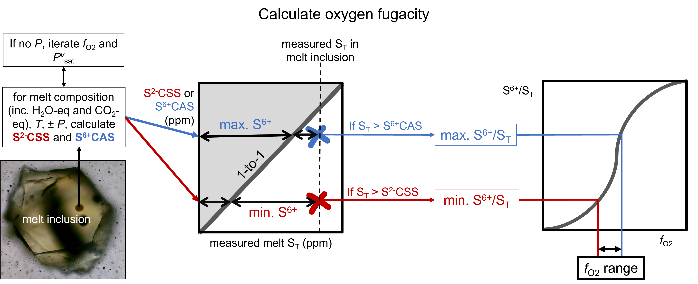

===============================================================
Oxygen fugacity from the melt sulfur content
===============================================================

Oxygen fugacity is a key thermodynamic parameter to estimate in magmatic systems because of its effects on the chemical and physical properties of the melt (e.g., Carmichael and Ghiorso, 1990; Hughes et al., 2024; Kolzenburg et al., 2018).
In certain circumstances, the sulfur content of the melt can be used to place bounds on the oxygen fugacity based on sulfide and anhydrite saturation (e.g., Beerman et al., 2011; Muth and Wallace, 2022; Hughes et al., 2023).

This calculation was outlined in detail in Section “Using *w*\ :sup:`m` \ :sub:`ST` as an oxybarometer” in `Hughes et al. (2023) <https://doi.org/10.1144/jgs2021-125>`_ (schematic of the calculation shown in the figure below; `Hughes et al., 2025 <https://doi.org/10.30909/vol/imvc1781>`_).

In these examples we will show you how to run this calculation for:

- :doc:`Example 3a <Examples/3a. SfO2 1MI_df>`: One analysis entered as a DataFrame using default options.

- :doc:`Example 3b <Examples/3b. SfO2 csv>`: Multiple analyses in a csv file using default options.

- :doc:`Example 3c <Examples/3c. SfO2 user_opt>`: Multiple analyses in a csv file using user-specified options.

- :doc:`Example 3d <Examples/3d. SfO2 error>`: Including uncertainties on inputs into the calculation outputs.